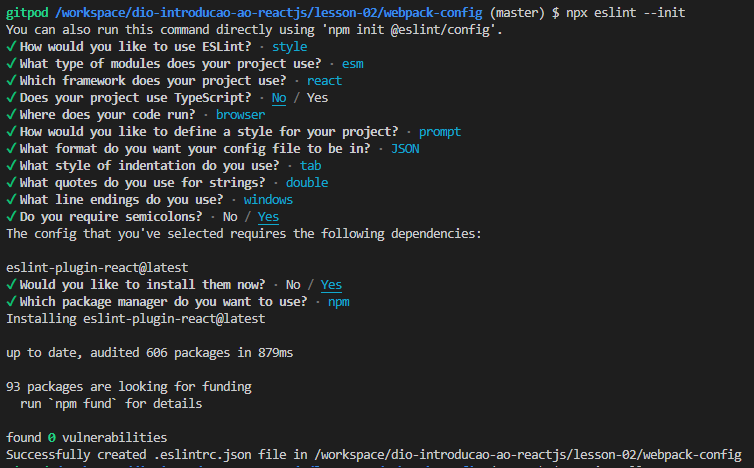

# DIO - Introdução ao ReactJS - Lição 02 - Webpack Config

## Anotações

### Webpack básico

- Iniciar o projeto:
    ```bash
    npm init
    ```
    - aceitar todos os valores padrões, a não ser que seja desejado alterar algo
- Instalar os pacotes `webpack` e `webpack-cli`:
    ```bash
    npm i -D webpack webpack-cli
    ```
    - o argumento `i` é o diminutivo de `install`
    - o argumento `-D` é o diminutivo de `--save-dev`
        - esse argumento serve para adicionar o(s) pacote(s) como `devDependencies`
- na raiz do projeto, criar um arquivo chamado `webpack.config.js`, contendo:
    ```js
    const path = require('path');

    module.exports = {
        entry: './teste.js',
        output: {
            path: path.resolve(__dirname, 'dist'),
            filename: 'bundle.js'
        }
    };
    ```
    - a primeira linha está importando o módulo `path` para podermos pegar caminhos de arquivos
    - nesse exemplo, `module.exports` tem as propriedades:
        1. `entry`: é o arquivo inicial usado pelo webpack para criar um bundle
            - no exemplo está `'./teste.js'`, mas normalmente colocamos no arquivo principal, como o `'./src/index.js'`
        2. `output`: possui propriedades que dirão onde vai ser a saída do bundle (propriedade `path`) e o nome do arquivo do bundle (propriedade `filename`)
            - não confundir o objeto `path` (início do arquivo) e a propriedade `path` (do `output`), pois o objeto usamos para resolver o caminho completo do arquivo
- No arquivo `package.json` ir no bloco `task` e adicionar a linha:
    ```json
    "build": "webpack --mode production"
    ```
    - o nome `"build"` pode ser qualquer nome, e o mesmo será usado para rodarmos a aplicação usando:
        ```bash
        npm run build
        ```
    - o `webpack --mode production` está executando o webpack no modo produção, utilizando de minificadores de código e outros plugins padrão
        - também é possível passar outros argumentos depois do `--mode`, como `development`

### Adicionando módulo `babel`

- Instalar os pacotes do `babel`:
    ```bash
    npm i -D @babel/core babel-loader @babel/preset-env @babel/preset-react
    ```
- Também instalar os pacotes do `react`:
    ```bash
    npm i react react-dom
    ```
- No arquivo `webpack.config.js`, devemos adicionar ao `module.exports` a propriedade `module`, e mudar o valor da propriedade `entry` para `./src/index.js` (caso ainda não tenha sido feito):
    ```js
    const path = require('path');

    module.exports = {
        entry: './src/index.js',
        output: {
            path: path.resolve(__dirname, 'dist'),
            filename: 'bundle.js'
        },
        module: {
            rules: [
                {
                    test: /\.(js|jsx)$/,
                    exclude: /node_modules/,
                    use: {
                        loader: 'babel-loader'
                    }
                }
            ]
        }
    };
    ```
- Criar um arquivo `.babelrc` com as configurações:
    ```json
    {
        "presets": [
            "@babel/preset-env",
            "@babel/preset-react"
        ]
    }
    ```
- No arquivo `package.json` ir no bloco `task` e adicionar a linha:
    ```json
    "dev": "webpack --mode development"
    ```
    - o nome `"dev"` pode ser qualquer nome, e o mesmo será usado para rodarmos a aplicação usando:
        ```bash
        npm run dev
        ```
    
### Adicionando plugins `html`

- Instalar pacotes `html`:
    ```bash
    npm i -D html-webpack-plugin html-loader
    ```
- No arquivo `webpack.config.js`, devemos importar o plugin `HtmlWebPackPlugin`, e adicionar ao `module.exports` a propriedade `plugins`:
    ```js
    const path = require('path');
    const HtmlWebPackPlugin = require('html-webpack-plugin');

    module.exports = {
        devtool: 'source-map',
        entry: './src/index.js',
        output: {
            path: path.resolve(__dirname, 'dist'),
            filename: 'bundle.js'
        },
        module: {
            rules: [
                {
                    test: /\.(js|jsx)$/,
                    exclude: /node_modules/,
                    use: {
                        loader: 'babel-loader'
                    }
                }
            ]
        },
        resolve: {
            extensions: ['.js', '.jsx']
        },
        plugins: [
            new HtmlWebPackPlugin({
                template: './src/index.html',
                filename: './index.html'
            })
        ]
    };
    ```

### Adicionando um `dev-server`

- Instalar o pacote `webpack-dev-server`:
    ```bash
    npm i -D webpack-dev-server
    ```
- No arquivo `package.json` ir no bloco `task` e adicionar a linha:
    ```json
    "start:dev": "webpack-dev-server"
    ```
    - o nome `"start:dev"` pode ser qualquer nome, e o mesmo será usado para rodarmos a aplicação usando:
        ```bash
        npm run start:dev
        ```

### Adicionando o `eslint`

- Instalar os pacotes do `eslint`:
    ```bash
    npm i -D eslint babel-eslint eslint-plugin-react eslint-watch
    ```
- Configurar o `eslint`:
    - Rodar o comando:
        ```bash
        npx eslint --init
        ```
        - Seguir os passos da imagem:
        
        - depois se certificar de o arquivo final ficar igual ao `.eslintrc` à seguir
    - Criar um arquivo `.eslintrc` com as configurações:
        ```json
        {
            "env": {
                "browser": true,
                "es2021": true
            },
            "extends": [
                "eslint:recommended",
                "plugin:react/recommended"
            ],
            "parserOptions": {
                "ecmaFeatures": {
                    "jsx": true
                },
                "ecmaVersion": "latest",
                "sourceType": "module"
            },
            "plugins": [
                "react"
            ],
            "rules": {
                "indent": [
                    "error",
                    "tab"
                ],
                "linebreak-style": [
                    "error",
                    "windows"
                ],
                "quotes": [
                    "error",
                    "double"
                ],
                "semi": [
                    "error",
                    "always"
                ]
            },
            "settings": {
                "react": {
                    "version": "18.1"
                }
            }
        }
        ```
- No arquivo `package.json` ir no bloco `task` e adicionar a linha:
    ```json
    "eslint": "eslint ./src/*.js"
    ```
    - o nome `"eslint"` pode ser qualquer nome, e o mesmo será usado para rodarmos a aplicação usando:
        ```bash
        npm run eslint
        ```